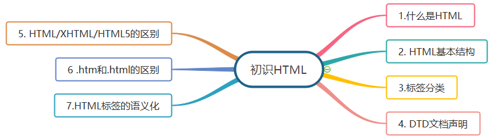
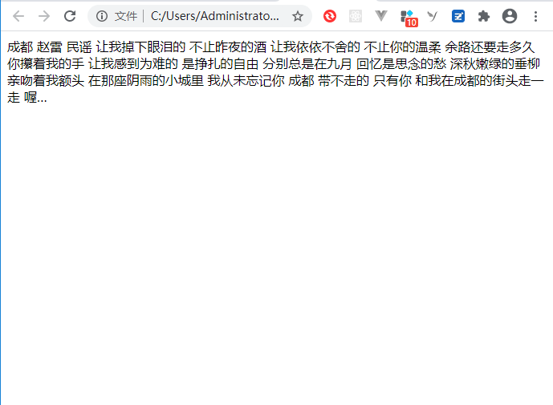
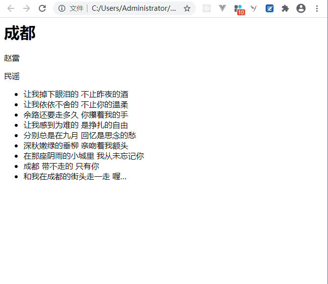
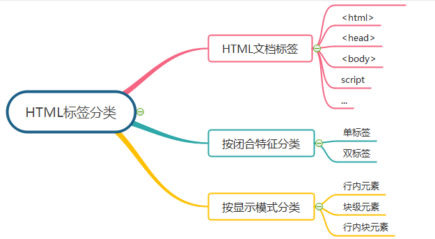
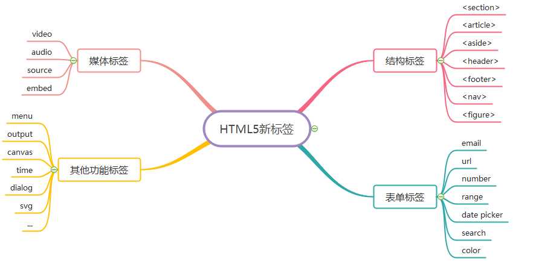

<!--  -->


## 什么是HTML
HTML是 `HyperText Markup Language` 的缩写，翻译过来就是 : **超文本标记语言**。超文本的意思就是不仅仅是文本， 还可以包含图片、链接、音频、视频甚至是程序等非文字元素。

那为什么会有HTML呢，接下来动手创建一个html文件，体会一下他的作用。

首先新建一个`1.txt`文本文件， 然后将拓展名`.txt`改为`.html`，输入文字内容，再用浏览器打开：

```
成都
赵雷
民谣
让我掉下眼泪的 不止昨夜的酒
让我依依不舍的 不止你的温柔
余路还要走多久 你攥着我的手
让我感到为难的 是挣扎的自由
分别总是在九月 回忆是思念的愁
深秋嫩绿的垂柳 亲吻着我额头
在那座阴雨的小城里 我从未忘记你
成都 带不走的 只有你
和我在成都的街头走一走 喔…
```



上图是利于浏览器打开后的效果，发现格式不对。原因是在纯文本文件中所以文字都是同级别的，浏览器不知道哪些文字代表什么意思，也就是说，浏览器不知道哪些文件代表标题，哪些文字是标题....所以无法展示出我们希望看到的效果

那么此时就能体现出HTML的作用， 它是专门用来描述文本语义的，也就是可以通过HTML来告诉浏览器哪些是标题，哪些是段落。我们将这些用于描述语义的文本称之为`标签`，这些用于描述文本语义的标签`不会在浏览器中显示出来`

先我们就利于标签对之前的 `1.html` 进行修改：
```html
<h1>成都</h1>
<p>赵雷</p>
<p>民谣</p>
<ul>
    <li>让我掉下眼泪的 不止昨夜的酒</li>
    <li>让我依依不舍的 不止你的温柔</li>
    <li>余路还要走多久 你攥着我的手</li>
    <li>让我感到为难的 是挣扎的自由</li>
    <li>分别总是在九月 回忆是思念的愁</li>
    <li>深秋嫩绿的垂柳 亲吻着我额头</li>
    <li>在那座阴雨的小城里 我从未忘记你</li>
    <li>成都 带不走的 只有你</li>  
    <li>和我在成都的街头走一走 喔…</li>
</ul>
```



::: warning
虽然上面我们利于`h1`描述文字后， 文字在浏览器中显示出来被放大和加粗了，但是`HTML是专门用来给文本添加语义的`， 而不是用于修改文本样式的
:::

## HTML结构
标准的`超文本标记语言`文件都具有一个基本的整体结构， 标记一般都是成对出现（部分标记除外，例如`<br />`）

接下来我们先认识一下HTML文件的基本结构：
```html
<html>
    <head>
        <title></title>
    </head>

    <body></body>
</html>
```
对HTML基本结构进行观察，不难发现这些`标签`都是成对出现的，而且开始标签不带`/`, 结束标签才带`/`。

接下来我们就对组成HTML基本结构的标签进行一个见面会, 逐一认识一下。

### html标签
**作用：**
- 告诉浏览器该文件是用超文件标记语言来描述的，即告诉浏览器我是一个HTML文档

**注意点：**
- 其它 `所有的标签` 都必须写在html标签里面, 也就是写在html开始标签`<html>`和结束标签`</html>`中间


### head 标签
**作用：**

- 用于给网页添加一些其他说明， 例如：
    1. 指定网页的标题
    2. 设置网页的小`icon`
    3. 添加网站SEO相关的信息（设置网页关键字、设置描述信息等）
    4. 外挂一些外部的css/js文件
    5. 添加一些浏览器适配相关的内容

**注意点：**
- 它本身不作为内容来显示，但影响网页显示的效果。

### title 标签

**作用：**
- 专门用于指定网站的标题, 并且这个指定的标题将来还会作为用户保存网站的默认标题

**注意点：**
- title标签必须写在head标签里面

### body
**作用：**
- 专门用于定义HTML文档中需要显示给用户查看的内容(文字/图片/音频/视频)
  
**注意点：**
- 虽然说有时候你可能将内容写到了别的地方在网页中也能看到, 但是千万不要这么干, 一定要将需要显示的内容写在body中
- 一对html标签中(一个html开始标签和一个html结束标签)只能有一对body标签


## 标签分类
上面我们学习了组成HTML基本结构的标签，其实HTML标签极其多，远不止上面那几个， 接下来我们就根据不同分类来认识这些标签：




### 文档标签
1. `<!DOCTYPE>`：定义文档类型。
2. `<html>`： 定义HTML文档。
3. `<head>`：定义文档的头部。
    - `<meta>`：定义元素可提供的有关页面的元信息，比如针对搜索引擎和更新频度的描述和关键字。
    - `<base>`：定义页面上的所有链接规定默认地址或默认目标。
    - `<title>`：定义文档标题。
    - `<link>`：定义文档与外部资源的关系。
    - `<style>`：定义HTML文档样式信息。
4. `<body>`：定义文档的主体。（脚本在非必需情况时在`<body>`的最后）
    - `<script>`：定义客户端脚本，比如javascript。
    - `<noscript>`：定义脚本未被执行时的替代内容。（如文本）
  

### 按闭合特征分类
单标签

单标签元素，也叫空标签或空元素，指没有内容的标签，在开始标签中自动闭合。
常见的空标签有：`<br />`、`<hr />`、 ``、 `<input />`、`<area />`、 `<base />`、 `<link />`、 `<meta />`等。


双标签

双标签元素，也叫闭合标签元素，是由开始标签和结束标签组成的一对标签，它可以嵌套和承载内容。
例如：`<div> </div>`、`<p> </p>`、`<html> </html>`、`<h1> </h1>`、`<span> </span>`等。

### 按显示模式分类

行内元素

行内元素（`inline-level`）也称内联元素，不占有独立的区域，靠自身字体大小和图像尺寸支撑大小，常用于控制页面中文本的样式。

:::tip 行内元素特点：

- 本身属性为 display：inline；
- 与相邻行内元素在同一行上；
- 对其设置宽、高、垂直方向的padding、margin值无效，但水平- 方向设置padding、margin值有效；
- 默认宽度是本身内容的宽度；
- 行内元素只能容纳文本或者其他行内元素（a特殊，链接中不可再- 放链接），不可在其中嵌套其他块级元素；
:::

常见的行内元素有：`<a>`、`<b>`、`<em>`、`<i>`、`<span>`、`<strong>`

块级元素

块级元素（`block-level`），每个元素单独占一整行或者多整行，通常用于进行大布局（大结构）的搭建。

::: tip 块级元素特点：
  - 本身属性为 display：block；
  - 每个块级元素独占一行，每个块级元素都会从新的一行开始，- 从上到下排布；
  - 可以设置宽高、内、外边距值；
  - 若不设置宽度和高度 ，则宽度默认为父级元素的宽度- （100%），高度根据内容大小自动填充；
  - 块级元素大多都可以容纳行内元素（内联元素 ）和其他块级元素；
:::

常见的行内元素有：`<div>`、`<p>`、`<form>`、`<table>`、`<hr>`、`<h1> to <h6>`、`<dl>、<dt>、<dd>`、`<ol>、<ul>、<li>`


行内块元素

行内块元素（`inline-block`），综合了行内元素和块级元素的特性，对象呈是`inline`的呈现方式，对象的内容是`block`样式。

:::tip 行内块元素特点：
- 本身属性为：display：inline-block；
- 与相邻行内元素、行内块元素在同一行上，排列方式为从左到右；
- 元素之间默认有间距；
- 可以设置宽高、内、外边距值；
- 默认宽度是本身内容的宽度；
:::

常见行内块元素有：``、`<input>`

### HTML5 新标签
一一列举是不可能的，也不切实际，毕竟新的标签太多了，这里就祭出常用的一些，上图：



## DTD文档声明
前面我们提到了标签`<DOCTYPE>`, 有的小伙伴可能还不太认识， 接下来我们就介绍一下。

首先我们需要知道什么是DTD文档声明？

由于HTML有很多个版本的规范, 每个版本的规范之间又有一定的差异. 所以为了让浏览器能够正确的编译/解析/渲染我们的网页, 我们需要在HTML文件的第一行告诉浏览器, 我们当前这个网页是用 `哪一个版本的HTML规范` 来编写的. 浏览器只要知道了我们是用哪一个版本的规范来编写之后, 它就能够正确的编译/解析/渲染我们的网页。

DTD文档声明格式：

```
<!DOCTYPE html>
```

::: warning 注意事项
- `<!DOCTYPE>` 声明必须是 HTML 文档的第一行，位于 `<html>` 标签之前
- `<!DOCTYPE>` 声明不是 HTML 标签
- `<!DOCTYPE>` 声明没有结束标签
- `<!DOCTYPE>` 声明对大小写不敏感
- 这个声明浏览器会看, 但是并不是完全依赖于这个声明, 浏览器有一套自己的默认的处理机制
    - 不写也能运行
    - H5网页里面用H4也能运行
:::

HTML5之前有`2大种规范`, 每种规范中又有`3小种规范`

1. HTML
    - Strict (严格的)
    - Transitional(过度的,普通的,宽松的)
    - Frameset(带有框架的页面)
2. XHTML
    - Strict (严格的)
    - Transitional(过度的,普通的,宽松的)
    - Frameset(带有框架的页面)

HTML的DTD文档声明和XHTML的DTD文档声明有何区别?
> XHTML本身规定比如标签必须小写、必须严格闭合、必须使用引号引起属性等等, 而HTML会更加松散没有这么严格

Strict表示严格的, 这种模式里面的要求更为严格.这种严格主要体现在有一些标签不能使用
> - 例如font标签/u标签等
> - font标签可以修改一个文本的字号、颜色、字体,但这和HTML的本质有冲突,因为HTML只能负责语义,不能负责样式,而font标签是用于修改样式的,所以在Strict中是不能使用font标签
> - u标签可以给一个文本加上下划线,但这和HTML的本质有冲突,因为HTML只能负责语义,不能负责样式,而u标签是用于添加下划线是样式.所以在Strict中是不能使用u标签

Transitional表示普通的, 这种模式是没有一些别的要求
> - 例如可以使用font标签、u标签等
> - 但是在企业开发中不会使用这些标签,因为这违背了HTML的本质, 而是将这些标签作为css的钩子使用

Frameset表示框架, 在框架的页面使用,这里暂不作详细介绍

- 有这么多规范我们学习过程中到底使用哪一种比较合适呢?
- 无论是HTML还是XHTML,过去企业级开发中用的比较多的大部分都是- Transitional类型的文档声明
- 但是HTML5的时代已经到来,以上6中规范仅仅作为了解, 以后都用HTML5类型的文档声明, HTML5向下兼容(求此刻WC3心里阴影面积)
- 目前国内一线网站都更新到了HTML5的文档声明, 所以后续授课也是全程使用HTML5的文档声明

## HTML、XHTML、HTML5 有什么区别
在HTML的早期发展中，大部分标准都是所谓的 `retro-spec`，即`先有实现后有标准`。在这种情况下，`HTML标准不是很规范，浏览器也对HTML页面中的错误相当宽容`。这反过来又导致了HTML开发者写出了`大量含有错误的HTML页面`

html语言本身有一些缺陷（例如： 内容和形式不能分离；标签单一；数据不能复用等等），随着`xml`的兴起人们希望`xml`来弥补html的不足，但是目前有成千上万的网页都是用html编写的，所以完全使用xml来替代html还为时过早，于是W3C在2000年推出了`xhtml1.0`， 建立`xhtml`的目的就是实现从html向`xml`的过度

为了规范HTML，W3C结合XML制定了`XHTML 1.0`标准，这个标准没有增加任何新的标签，只是按照XML的要求来规范HTML，并定义了一个新的 MIME type application/xhtml+xml。W3C的初衷是要求浏览器对这个MIME type实行强错误检查，如果页面有HTML错误，就要显示错误信息。但是由于已有的web页面中已经有了大量的错误，很多开发者拒绝使用新的MIME type。W3C不得已，在`XHTML 1.0`的标准之后增加了一个附录C，允许开发者使用XHTML语法来写页面，同时使用旧的MIME type，application/html，来分发页面

W3C随后在`XHTML 1.1中取消了附录C`，即使用`XHTML 1.1`标准的页面必须用新的MIME type来分发。于是这个标准并没有很多人采用

有了`XHTML`的教训，W3C在制定下一代HTML标准时（HTML5），就将向后兼容作为了一个很重要的原则。HTML5确实引入了许多新的特性，但是它最重要的一个特性是，不会break已有的网页。你可以将任何已有的网页的第一行改成<!DOCTYPE html>，它就成也一个HTML5页面，并且可以照样在浏览器里正常的展示。

HTML:是语法比较宽松，不严格的Web语言
1. 对大小写不敏感
2. 松散、简单
3. 不需要一定闭合

XHTML:更为严格,它要求标签必须小写、必须严格闭合、标签中的属性必须使用引号引起等等;

HTML5: 是HTML的下一个版本所以除了非常宽松容错性强以外,还增加许多新的特性

## .htm 和 .html扩展名区别
- DOS操作系统（win95或win98）下只能支持长度为3的后缀名，所以是htm
- 但在windows后缀长度可以大于3位，所以windows下无所谓htm与html，html是为长文件的格式命名的
- 所以htm是为了兼容过去的DOS命名格式存在的

## 语义化HTML
我们经常听说一个词`语义化HTML`，而且以前面试时也容易遇到， 那么究竟什么是语义化HTML呢？基于前面我们对HTML的学习， 来进行一下理解

简单来说，语义化HTML其实就是一种HTML编写的方式， 选择合适的标签、合理的代码结构来展示内容， 便于开发者阅读，同时也要便于浏览器爬虫和搜索引擎解析。 利于爬虫标记、利于SEO

HTML为网页文档内容提供上下文结构和含义。对于HTML体系而言，Web语义化是指使用语义恰当的标签，使页面有良好的结构，让页面元素有含义，便于被浏览器、搜索引擎解析、利于SEO。通常我们所说的HTML应该是完全脱离表现信息的，其中的标签应该都是语义化地定义了文档的结构。 代码示例：
```html
<html>
    <head>
        <meta charset="utf-8" />
        <title>个人博客</title>
    </head>
    <body>
        <article>
            <header>
                <h1>HTML基础-初识HTML</h1>
            </header>
            <nav>
                <ul>
                    <li>什么是HTML</li>
                    <li>HTML基本结构</li>
                    <li>标签分类</li>
                </ul>
            </nav>
            <section>
                section1-什么是HTML
            </section>
            <section>
                section2-HTML基本结构
            </section>
        </article>
        <footer>前端饭圈-前端学习网站</footer>
    </body>
</html>
```

# 给我留言
<Vssue title="给我留言" />