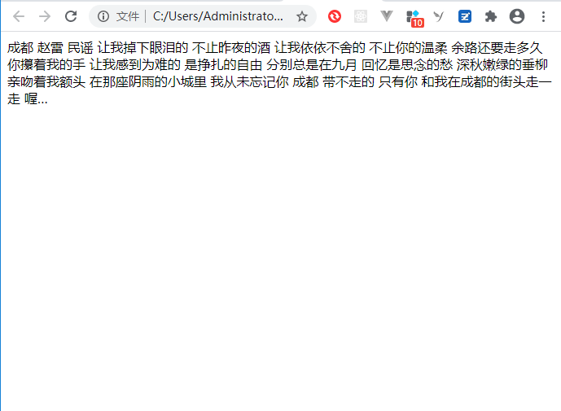
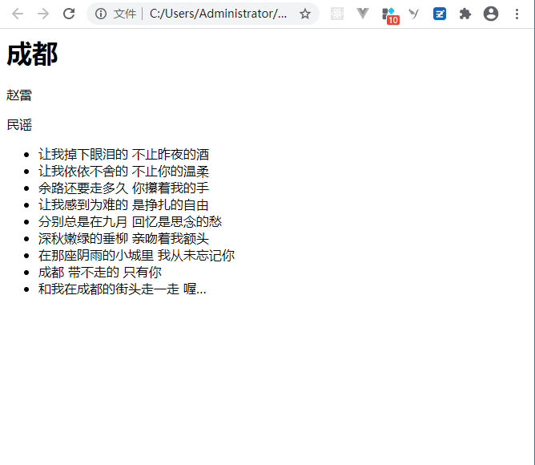

<!--  -->


## 什么是HTML
HTML是 `HyperText Markup Language` 的缩写，翻译过来就是 : **超文本标记语言**。超文本的意思就是不仅仅是文本， 还可以包含图片、链接、音频、视频甚至是程序等非文字元素。

那为什么会有HTML呢，接下来动手创建一个html文件，体会一下他的作用。

首先新建一个`1.txt`文本文件， 然后将拓展名`.txt`改为`.html`，输入文字内容，再用浏览器打开：

```
成都
赵雷
民谣
让我掉下眼泪的 不止昨夜的酒
让我依依不舍的 不止你的温柔
余路还要走多久 你攥着我的手
让我感到为难的 是挣扎的自由
分别总是在九月 回忆是思念的愁
深秋嫩绿的垂柳 亲吻着我额头
在那座阴雨的小城里 我从未忘记你
成都 带不走的 只有你
和我在成都的街头走一走 喔…
```



上图是利于浏览器打开后的效果，发现格式不对。原因是在纯文本文件中所以文字都是同级别的，浏览器不知道哪些文字代表什么意思，也就是说，浏览器不知道哪些文件代表标题，哪些文字是标题....所以无法展示出我们希望看到的效果

那么此时就能体现出HTML的作用， 它是专门用来描述文本语义的，也就是可以通过HTML来告诉浏览器哪些是标题，哪些是段落。我们将这些用于描述语义的文本称之为`标签`，这些用于描述文本语义的标签`不会在浏览器中显示出来`

先我们就利于标签对之前的`1.html`进行修改：
```html
<h1>成都</h1>
<p>赵雷</p>
<p>民谣</p>
<ul>
    <li>让我掉下眼泪的 不止昨夜的酒</li>
    <li>让我依依不舍的 不止你的温柔</li>
    <li>余路还要走多久 你攥着我的手</li>
    <li>让我感到为难的 是挣扎的自由</li>
    <li>分别总是在九月 回忆是思念的愁</li>
    <li>深秋嫩绿的垂柳 亲吻着我额头</li>
    <li>在那座阴雨的小城里 我从未忘记你</li>
    <li>成都 带不走的 只有你</li>  
    <li>和我在成都的街头走一走 喔…</li>
</ul>
```




