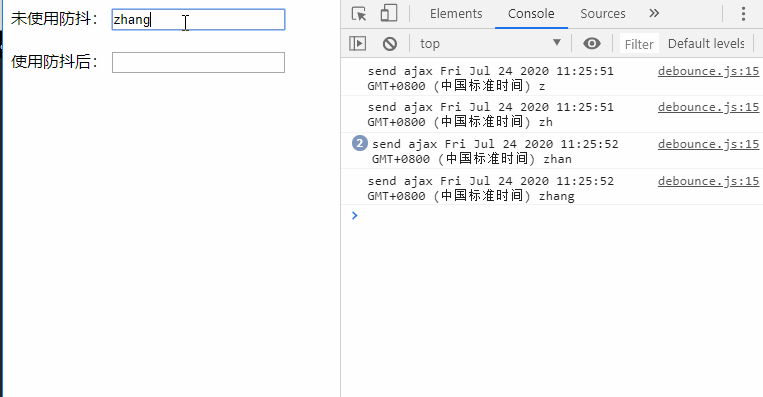
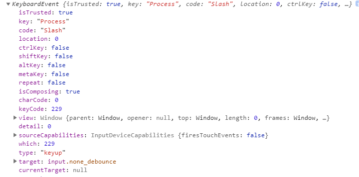
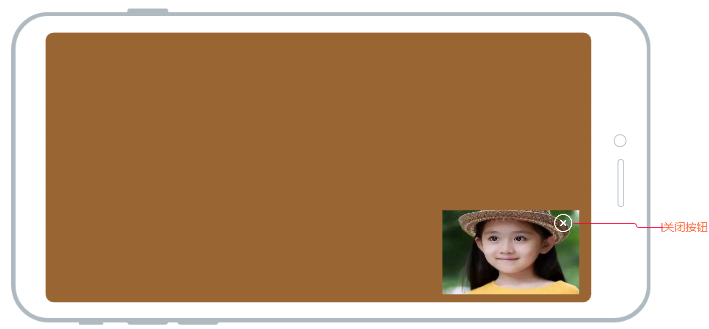

## 介绍防抖原理、区别以及应用，并使用js实现

### 函数防抖
- 原理：当持续触发一个事件时，在n秒内，事件没有再次触发，此时才会执行回调； 如果n秒内，又触发了事件，就重新计时

- 适用场景：
    - search远程搜索框：防止用户不断输入过程中，不断请求资源，n秒内只发送1次，用防抖来节约资源
    - 按钮提交场景，比如点赞，表单提交等，防止多次提交
    - 监听resize触发时， 不断的调整浏览器窗口大小会不断触发resize，使用防抖可以让其只执行一次
- 辅助理解：
  在你坐电梯时，当一直有人进电梯（连续触发），电梯门不会关闭，在一定时间间隔内没有人进入（停止连续触发）才会关闭。

下面我们先实现一个简单的防抖函数，请看栗子：
```javascript
// 简单防抖函数
const debounce = (fn, delay) => {
    let timer;
    return function () {
        const context = this
        const args = arguments
        clearTimeout(timer)

        timer = setTimeout(function(){
            fn.call(context, ...args)
            //等同于上一句 fn.apply(context, args)
        }, delay)
    }
}

// 请求接口方法
const ajax = (e) =>{
    console.log(`send ajax ${new Date()} ${e.target.value}`)
}

// 绑定监听事件
const noneDebounce = document.getElementsByClassName("none_debounce")[0]
const debounceInput = document.getElementsByClassName("debounce")[0]

noneDebounce.addEventListener('keyup', ajax)       
debounceInput.addEventListener('keyup', debounce(ajax, 500))
``` 

运行效果如下：


点击这里，试试效果[点击demo](https://jsbin.com/wefeyey/1/edit?html,js,console,output)

可以很清晰的看到，当我们频繁输入时， 不使用节流就会不断的发送数据请求，但是使用节流后，只有当你在指定间隔时间内没有输入，才会执行发送数据请求的函数。

上面有个注意点：
- this指向问题，在定时器中如果使用箭头函数`()=>{fn.call(this, ...args)}` 与上面代码效果一样， 原因时箭头函数的this是**继承父执行上下文里面的this**


### 关于防抖函数的疑问：
1. 为什么要使用 `fn.apply(context, args)`, 而不是直接调用 `fn(args)`

如果我们不使用防抖函数`debounce`时， 在`ajax`函数中打印this的值为`dom`节点：
```html
    <input class="debounce" type="text">
```
在使用debounce函数后，如果我们不使用`fn.apply(context, args)`修改this的指向， this就会指向window(ES6下为undefined)

2. 为什么要传入arguments参数

我们同样与未使用防抖函数的场景进行对比
```javascript
const ajax = (e) =>{
    console.log(e)
}
``` 

3. 怎么给ajax函数传参

有的小伙伴就说了， 你的ajax只能接受绑定事件的参数，不是我想要的，我还要传入其他参数，so easy!
```javascript
const sendAjax = debounce(ajax, 1000)
sendAjax(参数1, 参数2,...)

```
因为sendAjax 其实就是`debounce`中return的函数， 所以你传入什么参数，最后都给了fn

在未使用时，调用ajax函数对打印一个`KeyboardEvent`对象


使用`debounce`函数时，如果不传入arguments, ajax中的参数打印为undefined,所以我们需要将接收到的参数，传递给fn


函数防抖的理解：
> 我个人的理解其实和平时上电梯的原理一样：
> 当一直有人进电梯时（连续触发），电梯门不会关闭，在一定时间间隔内没有人进入（停止连续触发）才会关闭。


从上面的例子，对防抖有了初步的认识，但是在实际开发中，需求往往要更加的复杂,比如我们要提交一个表单按钮，为了防止用户多次提交表单，可以使用节流， 但如果使用上面的节流，就会导致用户停止连续点击才会提交，而我们希望让用户点击时，立即提交， 等到n秒后，才可以重新提交。

对上面的代码进行改造，得到立即提交版：

```JavaScript
const debounce = (fn, delay, immediate) => {
    let timer
    return function () {
        const context = this
        const args = arguments
        clearTimeout(timer)

        if (immediate) {
            let startNow = !timer

            timer = setTimeout(function () {
                timer = null
            }, delay)

            if (startNow) {
                fn.apply(context, args)
            }
        } else {
            timer = setTimeout(function () {
                fn.call(context, ...args)
                //等同于上一句 fn.apply(context, args)
            }, delay)
        }
    }
}
```
从上面的代码可以看到，通过`immediate` 参数判断是否是立刻执行。

```javascript
timer = setTimeout(function () {
    timer = null
}, delay)
```
立即执行的逻辑中，如果去掉上面这小段代码， 也是立即执行，但是之后就不会再执行提交了，当我们提交失败了怎么办（哭），所以加上上面这段代码，在设定的时间间隔内，将`timer`设置为null, 过了设定的时间间隔，可以再次触发提交按钮的立即执行，这才是完整的。

这是一个使用立即提交版本的防抖实现的了一个[提交按钮demo](https://jsbin.com/hurisoq/1/edit?html,css,js,console,output)


目前我们已经实现了包含`非立即执行`和`立即执行`功能的防抖函数，感兴趣的小伙伴可以和我一起继续探究一下去，完善防抖函数~

> 做直播功能时，产品的小伙伴给提出这样一个需求：
> 
> 直播的小窗口可以拖动， 点击小窗口以及拖动时， 显示关闭小窗口按钮，当拖动结束2s后， 隐藏关闭按钮； 当点击关闭按钮时， 关闭小窗口 

页面原型如下图所示：



分析需求， 我们可以使用防抖来实现， 用户连续拖动小窗口过程中， 不执行隐藏关闭按钮，拖动结束后2s才执行隐藏关闭按钮； 但是点击关闭按钮后，我们希望可以取消防抖， 所以需要继续完善防抖函数， 使其可以被取消。

**可取消版本**

```javascript
const debounce = (fn, delay, immediate) => {
    let timer, debounced
    // 修改--
    debounced = function () {
        const context = this
        const args = arguments
        clearTimeout(timer)

        if (immediate) {
            let startNow = !timer

            timer = setTimeout(function () {
                timer = null
            }, delay)

            if (startNow) {
                fn.apply(context, args)
            }
        } else {
            timer = setTimeout(function () {
                fn.call(context, ...args)
            }, delay)
        }
    }

    // 新增--
    debounced.cancel = function () {
        clearTimeout(timer)  
        timer = null
    }

    return debounced
}
```

从上面代码可以看到，修改的地方是将return的函数赋值给`debounced`对象， 并且给`debounced`扩展了一个`cancel`方法， 内部执行了清除定时器`timer`, 并且将其设置为null; 为什么要将timer设置为`null`呢? 由于`debounce`内部形成了闭包， 避免造成内存泄露

上面的需求我写了个小demo, 需要的小伙伴可以看看[可取消版本demo](https://jsbin.com/hefigub/4/edit?html,css,js,output), 效果如下所示：


    