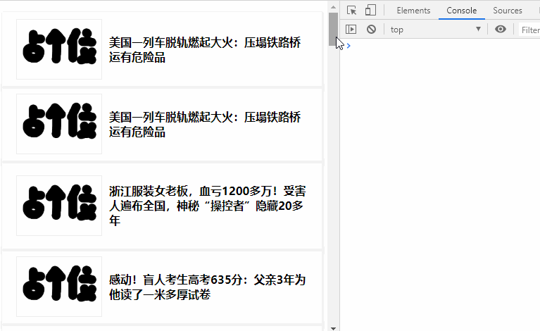
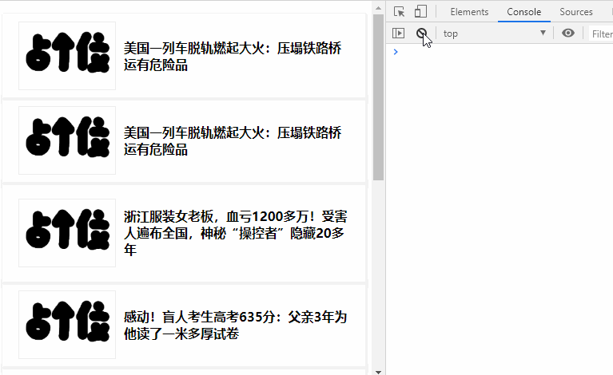
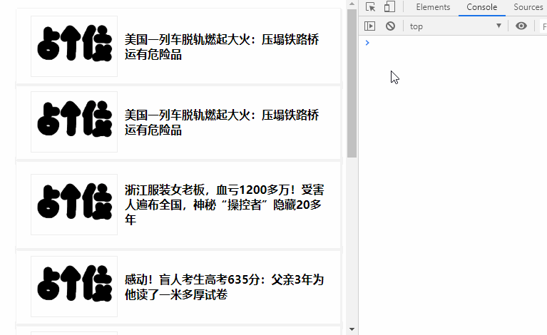

## 介绍节流原理、区别以及应用，并使用js实现

前面学习了防抖，也知道了我们为什么要使用防抖来限制事件触发频率，那我们接下来学习另一种限制的方式`节流（throttle）`

## 函数节流
- 原理：当频繁的触发一个事件，每隔一段时间， 只会执行一次事件。
- 适用场景：
  - 拖拽场景：固定时间内只执行一次， 防止高频率的的触发位置变动 
  - 监听滚动事件：实现触底加载更多功能
  - 屏幕尺寸变化时， 页面内容随之变动，执行相应的逻辑
  - 射击游戏中的mousedown、keydown时间


下面我们就来实现一个简单的节流函数，由于每隔一段时间执行一次，那么就需要计算时间差，我们有两种方式来计算时间差：一种是使用时间戳，另一种是设置定时器

## 使用时间戳实现
```javascript
function throttle(func, delay) {
    let args
    let lastTime = 0

    return function(){
        // 获取当前时间
        const currentTime = new Date().getTime()
        args = arguments

        if(currentTime - lastTime > delay ){
            func.apply(this, args)
            lastTime = currentTime
        }

    }
}
```
使用时间搓的方式来实现的思路比较简单，当触发事件时，获取当前时间戳，然后减去之前的时间戳（第一次设置为0）， 如果差值大于设置的等待时间， 就执行函数，然后更新上一次执行时间为为当前的时间戳，如果小于设置的等待时间，就不执行。

## 使用定时器实现
下面我们来看使用定时器实现的方式：与时间戳实现的思路是有差别的， 我们在事件触发时设置一个定时器， 当再次触发事件时， 如果定时器存在，就不执行；等过了设置的等待时间，定时器执行，我们需要在定时器执行时，清空定时器，这样就可以设置下一个定时器了
```javascript
function throttle1(fn, delay) {
    let timer
    return function () {
        const context = this
        let args = arguments
        
        if (timer) return
        timer = setTimeout(function () {
            console.log('hahahhah')
            fn.apply(context, args)

            clearTimeout(timer)
            timer = null
        }, delay)
    }
}
```
虽然两种方式都实现了节流， 但是他们达到的效果还是有一点点差别的，第一种实现方式，事件触发时，会立即执行函数，之后每隔指定时间执行，最后一次触发事件，事件函数不一定会执行；假设你将等待时间设置为1s， 当3.2s时停止事件的触发，那么函数只会被执行3次，以后不会再执行。 

第二种实现方式，事件触发时，函数不会立即执行， 需要等待指定时间后执行，最后一次事件触发会被执行；同样假设等待时间设置为1s, 在3.2秒是停止事件的触发，但是依然会在第4秒时执行事件函数

### 总结
对两种实现方式比较得出：
1. 第一种方式， 事件会立即执行， 第二种方式事件会在n秒后第一次执行
2. 第一种方式，事件停止触发后，就不会在执行事件函数， 第二种方式停止触发后仍然会再执行一次

接下来我们写一个下拉加载更多的小demo来验证上面两个节流函数：[点击查看代码]()
```javascript
    let state = 0 // 0: 加载已完成  1：加载中  2:没有更多
    let page = 1
    let list =[{...},{...},{...}]

    window.addEventListener('scroll', throttle(scrollEvent, 1000))

    function scrollEvent() {
        // 当前窗口高度
        let winHeight =
            document.documentElement.clientHeight || document.body.clientHeight

        // 滚动条滚动的距离
        let scrollTop = Math.max(
            document.body.scrollTop,
            document.documentElement.scrollTop
        )

        // 当前文档高度
        let docHeight = Math.max(
            document.body.scrollHeight,
            document.documentElement.scrollHeight
        )
        console.log('执行滚动')

        if (scrollTop + winHeight >= docHeight - 50) {
            console.log('滚动到底部了！')
            if (state == 1 || state == 2) {
                return
            }
            getMoreList()
        }
    }

    function getMoreList() {
        state = 1
        tipText.innerHTML = '加载数据中'
        setTimeout(() => {
            renderList()
            page++

            if (page > 5) {
                state = 2
                tipText.innerHTML = '没有更多数据了'
                return
            }
            state = 0
            tipText.innerHTML = ''
        }, 2000)
    }

    function renderList() {
        // 渲染元素
        ...
    }
```

使用第一种方式效果如下：



一开始滚动便会触发滚动事件， 但是在滚动到底部时停止， 不会打印"滚动到底部了"; 这就是由于事件停止触发后，就不会在执行事件函数

使用第二种方式， 为了看到效果，将事件设置为3s, 这样更能直观感受到事件函数是否立即执行：
```javascript
// window.addEventListener('scroll', throttle(scrollEvent, 1000))
window.addEventListener('scroll', throttle1(scrollEvent, 3000))

```



一开始滚动事件函数并不会被触发，而是等到3s后才触发； 而当我们快速的滚动到底部后停止滚动事件， 最后还是会执行一次

上面的这个例子是为了辅助理解这两种实现不方式的不同。

## 时间戳 + 定时器实现版本
在实际开发中， 上面两种实现方案都不满足我们的需求，我们希望一开始滚动就立即执行，停止触发的时候也还能执行一次。
结合时间搓方式和定时器方式实现如下：
```javascript
function throttle(fn, delay) {
    let timer , context, args
    let lastTime = 0

    return function (){
        context = this
        args = arguments;

        let currentTime = new Date().getTime()

        if (currentTime - lastTime > delay) {
            // 防止时间戳和定时器重复
            // -----------
            if (timer) {
                clearTimeout(timer)
                timer = null
            }
            // -----------
            fn.apply(context, args)
            lastTime = currentTime
        }
        if(!timer) {
            timer = setTimeout(() =>{
                // 更新执行时间, 防止重复执行
                // -----------
                lastTime = new Date().getTime()
                // -----------
                fn.apply(context, args)
                clearTimeout(timer)
                timer = null
            }, delay)
        }
    }
}
```
使用演示效果如下：



实现思路是结合两种实现方式，同时避免两种方式重复执行， 所以当调用时间戳执行函数时，需要将定时器清空；当使用到定时器执行函数时，需要增加修改执行记录的时间`lastTime`

我们可以看到，开始滚动立即会打印`页面滚动了`，停止滚动后，时间会再执行一次，滚动到底部时停止，也会执行到`滚动到底部了`

## 最终完善版
上面的节流函数满足了我们的基本需求， 但是我们可以进一步对节流函数进行优化，使得节流函数可以满足下面三种情况：
- 事件函数立即执行，并且事件停止后再执行一次（以满足）
- 事件函数立即执行，但是事件停止后不再执行（待探究）
- 事件函数不立即执行，但是事件停止后再执行一次（待探究）

> 注意点：
> 事件函数不立即执行，事件停止不再执行一次 这种情况不能满足，在后面从代码角度会做分析。

我们设置两个参数`start`和`last`分别控制是否立即执行与最后是否执行；修改上一版代码， 实现如下：
```javascript
function throttle(fn, delay, option = {}) {
    let timer, context, args
    let lastTime = 0

    return function () {
        context = this
        args = arguments

        let currentTime = new Date().getTime()

        // 增加是否立即执行判断
        if (option.start == false && !lastTime) lastTime = currentTime

        if (currentTime - lastTime > delay) {
            if (timer) {
                clearTimeout(timer)
                timer = null
            }
            fn.apply(context, args)
            lastTime = currentTime
        }
        // 增加最后是否再执行一次判断
        if (!timer && option.last == true) {
            timer = setTimeout(() => {
                // 确保再次触发事件时， 仍然不立即执行
                lastTime = option.start ==false? 0 : new Date().getTime()
                fn.apply(context, args)
                clearTimeout(timer)
                timer = null
            }, delay)
        }
    }
}
```
上面代码就修改了三个地方，一个是立即执行之前增加一个判断：
```javascript
    if (option.start == false && !lastTime) lastTime = currentTime
```
如果传入参数是非立即执行， 并且`lastTime`为0, 将当前时间戳赋值给`lastTime`， 这样就不会进入 ` if (currentTime - lastTime > delay)`

第二个修改地方， 增加最后一次是否执行的判断：
```javascript
    // 原来
    // if (!timer) {...}

   // 修改后
   if (!timer && option.last == true) {
         ...
    }
```

当传入`last`为true时，才使用定时器计时方式， 反之通过时间戳实现逻辑即可满足

第三个修改的地方， 也是容易被忽视的点， 如果`start`传入false,`last`传入true(即不立即执行，但最后还会执行一次), 需要在执行定时器逻辑调用事件函数时， 将`lastTime`设置为0：
```javascript
   // 确保再次触发事件时， 仍然不立即执行
    lastTime = option.start ==false? 0 : new Date().getTime()
```
这里解决的是再次触发事件时， 也能保证不立即执行。

### 疑问点
相信有的小伙伴会存在疑问，为什么没有讨论不立即执行， 最后一次也不执行的情况呢（即 `start`为true, `last`为true）, 因为这种情况满足不了。

当最后一次不执行， 也就不会进入到 定时器执行逻辑，也就无法对 `lastTime`重置为0，所以，当再一次触发事件时，就会立即执行，与我们的需求矛盾了。关于这一点，大家了解即可

到这里，我们的节流函数功能就差不多了， 如果有兴趣的小伙伴可以自己实现一下可取消功能， 与防抖函数实现方式一致， 这里就不赘述了


