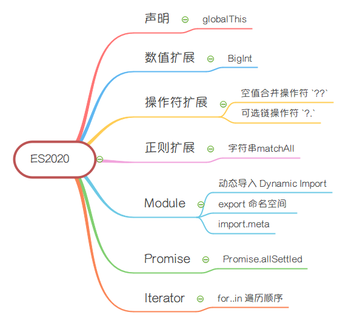
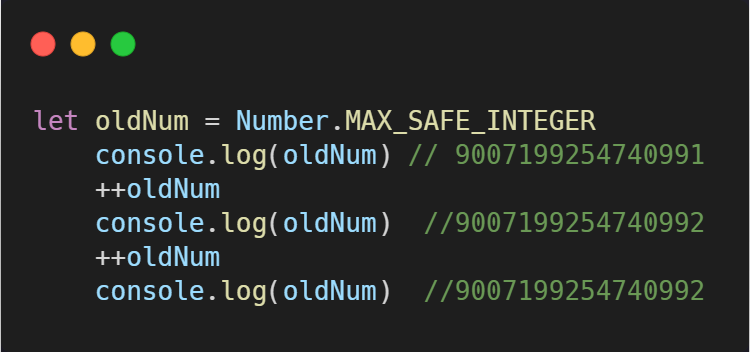
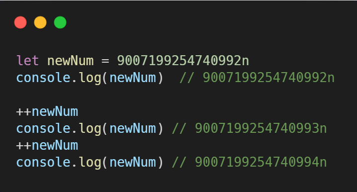

# 你应该知道的ES2020中的10个Javascript新功能（译）

<!-- <p align="center">
  
</p> -->


ES2020的新功能现已完成！这意味着我们现在对ES2020中发生的变化有了完整的了解，ES2020是`JavaScript`的新的和改进的规范。让我们看看这些变化是什么。

<!-- more -->
<!-- 作用是简介 -->

<!--  -->

<!-- https://www.freecodecamp.org/news/javascript-new-features-es2020/ -->


## gloabThis
我们都知道`JavaScript`可以运行在浏览器上，也可以运行在Node中，当我们写一段js代码，不确定将来一定是在哪个环境中运行时，就很难掌握全局对象。
- Browser中， 顶层对象是 `window`
- Node中， 顶层对象是 `global`
- WebWorker中， 顶层对象是 `self`

ES2020带给我们`globalThis`不管您在哪里执行代码，它始终引用全局对象， 即上面三种环境都通用顶层对象`globalThis`
```javascript
// Browser中
globalThis.setInterval === globalThis.setInterval  // true

// node中
globalThis.setInterval === global.setInterval
```


## BigInt
ES2020之前， 你可以在`JavaScript`中存储为整数的最大数量`2^53 - 1`,`Number.MAX_SAFE_INTEGER` 常量表示在 `JavaScript` 中最大的安全整数（maxinum safe integer)`2^53 - 1`。

```javascript
let oldNum = Number.MAX_SAFE_INTEGER
    console.log(oldNum) // 9007199254740991
    ++oldNum
    console.log(oldNum)  //9007199254740992
    ++oldNum
    console.log(oldNum)  //9007199254740992
```

BigInt 是一种内置对象，它提供了一种方法来表示大于 `2^53 - 1` 的整数。

```javascript
let newNum = 9007199254740992n
console.log(newNum)  // 9007199254740992n

++newNum
console.log(newNum) // 9007199254740993n
++newNum
console.log(newNum) // 9007199254740994n
```

如上所示， 你可以用在一个整数字面量后面加 `n` 的方式定义一个 BigInt, `JavaScript`引擎（V8引擎或者使用它的任何引擎）会对它们进行不同的处理。

但是此改进不向后兼容，因为`Javascript`的数字存储使用了`IEEE 754`中规定的双精度浮点数数据类型，而这一数据类型能够安全存储 `-(2^53 - 1)` 到 `2^53 - 1` 之间的数值（包含边界值）。（它不能支持这种大小的数字）。

## 空值合并操作符 `??`
在`JavaScript`中,很多值都表现为假值, 比如空字符串、数值0、`undefined`、`null`、`NaN`等等

但在开发中，当一个变量可以是空串或者是`false`时，很多时候我们需要检查它是否为`null`或者`undefined`。

此时我们就可以使用空值合并操作符`??`, 它是一个逻辑操作符， 当左侧操作数为`null`或者`undefined`时， 返回其右侧操作数， 否则返回左侧操作数。见下面的例子：

```javascript
let defaultValue = {
    nullValue: null,
    emptyValue: "",
    zeroValue: 0,
    falseValue: false,
    numberValue:100
}

const definedValue=  defaultValue.definedValue ?? "初始值"
// definedValue => 初始值

const nullValue = defaultValue.nullValue ?? "初始值"
// nullValue =>初始值

const emptyValue = defaultValue.emptyValue ?? "初始值"
// emptyValue => ""

const zeroValue = defaultValue.zeroValue ?? "初始值"
// zeroValue => 0

const falseValue = defaultValue.falseValue ?? "初始值"
// falseValue => false

const numberValue = defaultValue.numberValue ?? 900
// numberValue => 100
```

上面的代码如果我们使用或操作符`||`会是什么样的结果呢？
```javascript
const definedValue=  defaultValue.definedValue || "初始值"
// definedValue => 初始值

const nullValue = defaultValue.nullValue || "初始值"
// nullValue =>初始值

const emptyValue = defaultValue.emptyValue || "初始值"
// emptyValue => "初始值"

const zeroValue = defaultValue.zeroValue || "初始值"
// zeroValue => 初始值

const falseValue = defaultValue.falseValue || "初始值"
// falseValue => 初始值

const numberValue = defaultValue.numberValue || 900
// numberValue => 100
```

对比上面两种实现方式，我们很容易就可以发现使用`||`为某些变量设置默认值时，可能会遇到意料之外的行为；而空值合并符`??`可以用来避免这种情况。

## 链判断操作符 `?.`
开发中我们经常遇到的一个错误就是：`Cannot read property 'XXX' of null`
很多时候都是我们在操作一个属性或者一个方法时，没有提前检查方法/属性是否存在。
举个例子：
```javascript
const box = document.querySelector(".box")

//  1.直接调用
box.setAttribute("href", "www.sss")

//2. 检查再调用
box && box.setAttribute("href", "www.sss")
```
直接调用时， 如果没有class为box的元素， box变量是为null, 就会报错； 第二种方式可以避免； 而我们可以使用链判断操作符来完成：

```javascript
box ?.setAttribute("href", "www.sss")
```
是不是感觉更方便了呢，函数

需要获取对象中的属性，在获取前，需要提前检查属性是否存在

## 动态导入 Dynamic Import

关于动态导入其实已经比较熟悉了，我们使用的`webpack`就支持它，用来在单页应用中拆分代码。

那import支持动态导入后， 以后就不需要借助`webpack`这样的第三方模块来实现了， 接下来认识一下`Dynamic Import`:

```javascript
import('/modules/my-module.js')
  .then((module) => {
      module.xxx
    // Do something with the module.
  });
```
上面这种方式调用，将返回一个`promise`， 当然也支持`async/await`的写法，将import返回的对象assign给一个常量/变量

```javascript
const module = await import('/modules/my-module.js');
module.xxx
// Do something with the module.

```


