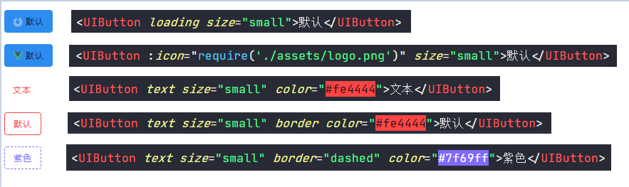

# vue3+typescript组件封装之button篇
前言

最近工作不是很忙，于是计划封装一个内部的组件库，平时习惯了使用别人封装好的组件， 并没有深究其中原理，只觉得并不是很难，但是当自己去揭开这层面纱后， 发现里面有非常多的点值得学习， 所以记录下来分享给大家

## 明确目标
在封装Button组件之前，我们需要先分析，希望Button有哪些特性及功能。


本次项目我们采用Vue3.0 + TypeScript来实现 UIButton的封装，我们这篇文章会从零开始来介绍按钮组件的封装。

## 创建工程
我们使用Vue CLI来创建一个`vue3 + TS`的工程，首先检查一下Vue CLI的版本：
```
vue -V
@vue/cli 4.3.1
```
如果大家的版本低于4.3.1，想要升级的话， 可以在命令行中输入`npm i -g @vue/cli`进行手动升级。

首先我们创建一个 vue3的项目：
```
vue create uifan
```
具体的创建过程和创建vue2项目没有什么区别，这里就不一步步介绍了， 说一下我这个项目选择了哪些选项：


## 实现基础按钮
首先我们需要实现一个基础的按钮， 包括按钮默认的一些样式、按钮标题以及按钮点击事件处理。
在`components`文件夹下创建`button`文件夹，文件夹内创建`UIButton.vue`文件：
```javascript
// UIButton.vue
<template>
    <button
        @click="onClickBtn"
        class="ui-btn"
    >
        <slot>按钮</slot>
    </button>
</template>

<script lang="ts">
import { Component, Vue, Emit } from "vue-property-decorator";

@Component
export default class App extends Vue {
    @Emit("click") private emitClick(event: MouseEvent) {}
    // 创建私有方法
    private onClickBtn(event: MouseEvent) {
        if (!this.disabled) {
            this.emitClick(event);
        }
    }
}
</script>

<style lang="stylus" scoped>
.ui-btn
    min-width 64px
    height 36px
    padding 0 16px
    border 0 solid black
    border-radius 4px
    font-size 0.875rem
    font-weight 500
    letter-spacing 0.09em
    cursor pointer
    color #17233d
    background-color #2d8cf0
    outline none
    user-select none
</style>
```
从上面代码可以看出，`UIButton`其实是对原生的button的一个封装，上面这个按钮组件实现了：
1. 按钮的基本样式
2. 按钮标题可以在组件使用时写
3. 按钮点击事件处理

接下来可以对封装的 `UIButton`组件进行使用：
```html
 <UIButton @click="onClick" ></UIButton>
 <UIButton @click="onClick" >我的Button</UIButton>
```

## 添加尺寸控制
封装几个常用的尺寸，例如迷你型（mini）、小型(small)、普通按钮(normal)、大型按钮(large)以及长按钮（long），使用时根据需求设置尺寸，不同尺寸的大小，他们的高度、字体大小以及padding值是不同， 首先展示一下不同尺寸封装完展示效果:
 


首先我们需要处理不同尺寸的样式，给不同尺寸设置不同的class来控制样式， 所以`UIButton`组件的class需要修改成动态的：
```javascript
 <button
        @click="onClickBtn"
        :class="[
            'ui-btn',
            size ? `ui-btn--${size}` : ''
        ]"
    >
        <slot>按钮</slot>
    </button>
```
size 是通过在组件是传入的， 所以使用`@Prop`接受：
```javascript
import { Component, Vue, Emit, Prop } from "vue-property-decorator";
export default class App extends Vue {
    // 尺寸 mini small normal large
    @Prop(String) private size: string | undefined;
}
```

最后设置`ui-btn--mini`,`ui-btn--small`等样式， 由于我们使用stylus的混合来实现（类似于js的函数），不了解stylus混合的小伙伴自行学习一下。
```css
@import "../style/var.styl";
resize(minWidth, height, paddingLR, fontSize)
    min-width minWidth
    height height
    padding 0 paddingLR
    font-size fontSize
.ui-btn
    ...
    &.ui-btn--mini
        resize($button-mini-width, $button-mini-height, $button-mini-paddingLR,$button-mini-font-size)
    &.ui-btn--small
        resize($button-small-width, $button-small-height, $button-small-paddingLR,$button-small-font-size)
    &.ui-btn--large
        resize($button-large-width, $button-large-height, $button-large-paddingLR,$button-large-font-size)
    &.ui-btn--normal
        resize($button-normal-width, $button-normal-height, $button-normal-paddingLR,$button-normal-font-size)
    &.ui-btn--long
        width 100%
```
其中`$button-mini-width`和`$button-mini-height`这些变量是我在`var.styl`文件中定义好的全局变量， 文末github地址可以查看完整代码。这样我们就要定义好了不同size的button按钮， 使用如下：
```html
<UIButton size="mini">超小</UIButton>
<UIButton size="small">小</UIButton>
<UIButton size="large">超大</UIButton>
```

## 控制按钮形状
提供的形状包含矩形按钮、圆角矩形、圆角按钮以及圆形按钮，默认情况下的按钮是圆角矩形的，下图为我们要封装的组件包含的形状：


通过传递`square`、`round`、`circle`分别代表矩形、圆角和圆形按钮，首先动态绑定class来控制按钮圆角样式
```JavaScript
 <button
        @click="onClickBtn"
        :class="[
            'ui-btn',
            size ? `ui-btn--${size}` : '',
            {
                'ui-btn--square': square,
                'ui-btn--round': round,
                'ui-btn--circle': circle,
            },
        ]"
    >
        <slot>按钮</slot>
    </button>

```
`square`、`round`、`circle`是通过组件使用是传递的， 在`UIButton`中需要prop接受这个三个变量:
```javascript
//形状
@Prop(Boolean) private round: boolean | undefined; //圆角
@Prop(Boolean) private square: boolean | undefined; //方形
@Prop(Boolean) private circle: boolean | undefined; //圆形
```
在写stylus要注意一点，圆形和圆角按钮的`border-radius`值与按钮高度有关， 所以可以写在上边定义的`resize`混合中：
```css
resize(minWidth, height, paddingLR, fontSize)
    min-width minWidth
    height height
    padding 0 paddingLR
    font-size fontSize
    &.ui-btn--round, &.ui-btn--circle
        border-radius (@height / 2)
    &.ui-btn--circle
        width @height
        min-width 0
        padding 0
.ui-btn
    ...
    &.ui-btn--square
        border-radius 0
```
使用如下：
```html
<UIButton square="square">矩形按钮</UIButton>
<UIButton >正常按钮</UIButton>
<UIButton round="round">圆角按钮</UIButton>
<UIButton circle="circle">圆形</UIButton>
```
## 设置按钮颜色
颜色包括按钮的背景颜色、文本颜色以及边框样色的控制。我们希望

这里我们需要使用到计算属性来获取颜色值，在类组件中定义计算属性和定义方法很相似， 只是方法前边需要加一个`get`


## 设置禁用

## 设置阴影

## 按钮类型设置
我们封装的按钮想要提供线框按钮、文本按钮以及图标按钮可供选择, 功能效果如下：



```
```


