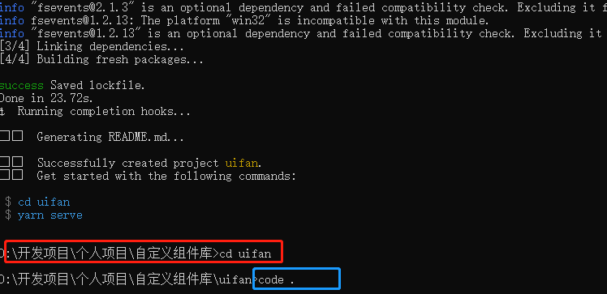
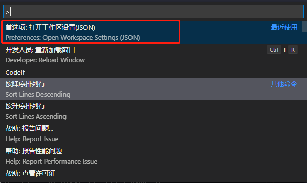
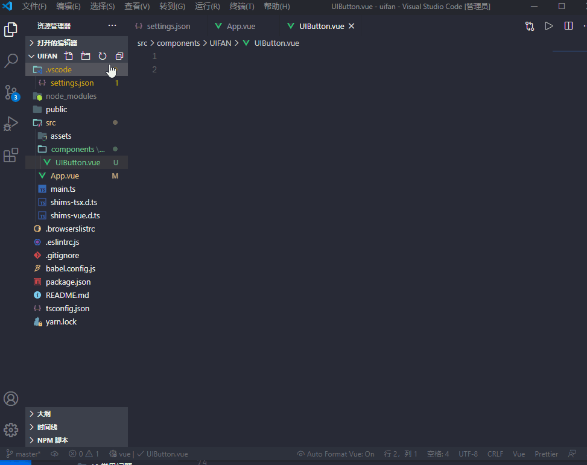
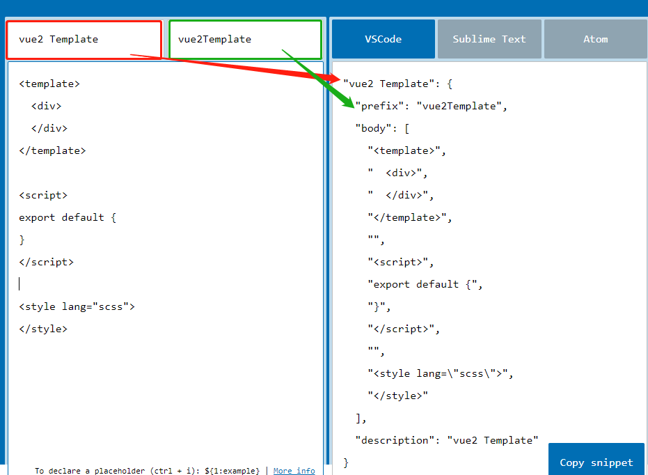
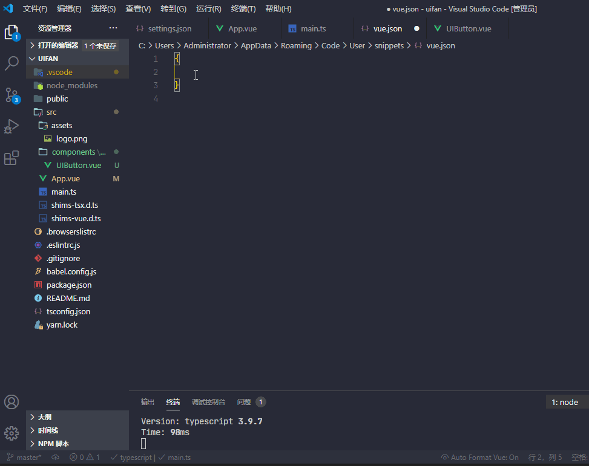
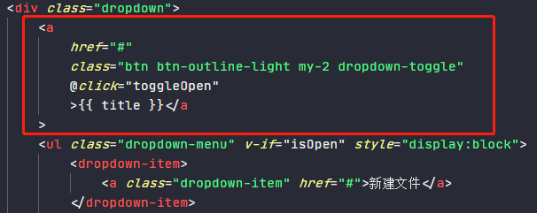

# vscode这些操作，你知道吗？
我们经常使用vscode, 文章中这些操作你知道多少

## 快速打开项目
当我们使用命令创建完成一个项目后， 你是不是直接将项目文件夹拖动到项目下， 亦或者是打开编辑器然后导入项目， 告诉你一个更快的办法。
首先进入项目目录
```
cd 项目目录
```
然后执行：
```
code .
```


就可以愉快的打开项目，开开心心写代码。

## 在当前项目下创建vscode的配置文件
我们在开发时，不同团队开发项目的规范都有一些差异， 那么如何保证开发工具的规范一直呢， 可以通过给项目一个自己的配置文件

在vscode中通过运行`ctrl+shit+p`,然后打开`首选项：打开工作区设置`：


就会在项目下生成一个`.vscode文件夹`，里面自动生成`setting.json`,项目的配置就可以写在这个文件中。


## 想让某些文件在vscode左侧列表隐藏
在项目开发中，有些文件是固定的，我们不需要对其进行任何的修改，此时可以将这些文件在vscode左侧导航列表中隐藏，可以避免误操作修改这些文件。

比如`babel.config.js`、`.gitignore`、`eslintrc.js`等等
配置`setting.json`文件:
```json
{
    "files.exclude": {
        "**/.git": true,
        "**/.svn": true,
        "**/.hg": true,
        "**/CVS": true,
        "**/.DS_Store": true,
        "**/.gitignore":true,
        "**/babel.config.js"
    }
}
```

## 生成代码片段
作为一名码农看别人写代码速度飞起来， 自己写代码就是蜗牛？ 嗯~，可能你没有找到诀窍。这里就介绍一个小窍门， 让你可以不用重复写那些相同的代码，让你可以像快捷键一样输入一个命令就可以调出这些代码多好，想想都很爽，那么学会代码片段(snippets)对于提高工作效率必不可少。

比如，你创建一个`.vue`文件， 下面这些内容觉不觉得眼熟呢？
```vue
<template>
  <div>
  </div>
</template>

<script>
export default {
}
</script>

<style lang="scss">
</style>
```
下面就学习，如何用一个命令就可以直接生成上面这段代码。

打开编辑器>文件>首选项>用户片段>输入要创建的代码类型>生成一个json文件



那么如何编写自己的代码片段呢？这里我先介绍些snippets的语法。

> snippets语法

```
prefix      :代码片段名字，即输入此名字就可以调用代码片段。
body        :这个是代码段的主体.需要编写的代码放在这里,　　　　　 
$1          :生成代码后光标的初始位置.
$2          :生成代码后光标的第二个位置,按tab键可进行快速切换,还可以有$3,$4,$5.....
${1,字符}    :生成代码后光标的初始位置(其中1表示光标开始的序号，字符表示生成代码后光标会直接选中字符。)
description :代码段描述,输入名字后编辑器显示的提示信息。
```
这个语法认识一下就行，不用深究。接下来介绍一个生成`snippet`的工具[snippet-generator](https://snippet-generator.app/)



只要将代码片段名字和代码片段描述写上， 然后将我们想要生成的代码片段拷贝进去，就可以在右侧生成代码片段,效果如下：



## 禁止保存自动格式化
在项目的setting.json文件中设置：
``` json
// 保存时格式化
"editor.formatOnSave": false,
```


## 使用VsCode写Vue.js注释有误的解决办法
### 方法1（不推荐）
在项目的setting.json文件中设置：
``` json
"files.associations": {
"*.vue": "html"
}
```
这种方式可以很暴力的解决当前问题， 但是也会导致其他问题，比如我的css 使用的是scss, 无法识别了

### 方法2（推荐）
如果你没有安装Vetur插件， 先安装； 如果按照了还是不行， 一定是因为产生了冲突。
我就是通过禁用已开启的插件的方式， 一步步定位到问题的。

我的是因为安装了`Vue 3 Snippets Highlight Formatters`; 所以我就选择禁用了它， 改用`Vue 2 Snippets`


## vscode 格式换标签，自动换行
开发中使用了`prettier`和 `vetur`两个插件， 每次格式化代码都会出现下图这种情况：


html标签被过度的换行了， 刚开始以为是`vetur`导致的， 就在网上找到了设置换行：
```json
 "vetur.format.defaultFormatter.html": "js-beautify-html",
    "vetur.format.defaultFormatterOptions": {
        "js-beautify-html": {
            // 强制展开多行
            // "wrap_attributes": "force-expand-multiline"  
            // 不换行 aligned-multiple
            "wrap_attributes": "auto"
        }
    },
```
但是并没有效果， 后来发现是`prettier`在搞怪，只需要设置`prettier`的超过最大值换行，就可以解决：
```json
"prettier.printWidth": 200, // 超过最大值换行
```