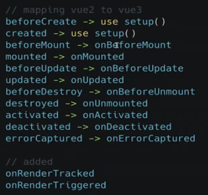

# 盘点Vue3新特性
## 前言
Vue3.0 在今年9月正式发布了，也有许多小伙伴都热情的拥抱Vue3.0。由于我当时负责的项目没有升级3.0的计划，所以自己一直都没有去深入的学习。but~, 突然公司要新做一个项目，早上起来发现自己居然被拉进了这个项目组，项目技术栈还是Vue3.0, 所以就不得不学习一下Vue3.0了。
首先我大概去了解了一下 Vue3.0 主要的一些特性：


为什么要有Vue3?

Vue2 遇到的难题
随着功能增长， 复杂组件的代码变得难以维护
上一个例子

## Composition API
使用Vue2.x的小伙伴都熟悉，Vue2.x中所有数据都是定义在`data`中，方法定义在`methods`中的，并且使用`this`来调用对应的数据和方法。
那Vue3.x中就可以不这么玩了， 具体怎么玩我们后续再说， 先说一下Vue2.x版本这么写有什么缺陷，所有才会进行升级变更的。

### 回顾Vue2.x实现加减

```javascript
<template>
  <div class="homePage">
    <p>count: {{ count }}</p>
    <p>倍数： {{ multiple }}</p>
    <div>
        <button style="margin-right:10px" @click="increase">加1</button>
        <button @click="decrease">减一</button>
    </div>
  </div>
</template>

<script>
export default {
  data() {
    return {
      count: 0,
    };
  },

  computed: {
    multiple() {
      return 2 * this.count;
    },
  },

  methods: {
    increase() {
      this.count++;
    },
    decrease() {
      this.count++;
    },
  },
};
</script>
```
上面代码只是实现了对`count`的加减以及显示倍数， 就需要分别在data、methods、computed中进行操作，当我们增加一个需求，就会出现下图的情况：


当我们业务复杂了就会大量上面的清理， 随着复杂度上升，就会出现这样一张图， 每个颜色的方块表示一个功能：


甚至一个功能还有会依赖其他功能，全搅合在一起。

当这个组件的代码超过几百行时，这时增加或者修改某个需求， 就要在data、methods、computed以及mounted中反复的跳转，这其中的的痛苦写过的都知道。

那我们就想啊， 如果可以按照逻辑进行分割，将上面这张图变成下边这张图，是不是就清晰很多了呢, 这样的代码可读性和可维护性都更高：


那么vue2.x版本给出的解决方案就是Mixin, 但是使用Mixin也会遇到让人苦恼的问题：
1. 命名冲突问题
2. 不清楚暴露出来的变量的作用
3. 逻辑重用到其他 component 经常遇到问题

关于上面经常出现的问题我就不一一举例了，使用过的小伙伴多多少少都会遇到。文章的重点不是Mixin,如果确实想知道的私聊啦~

所以，我们Vue3.x就推出了`Composition API`主要就是为了解决上面的问题，将零散分布的逻辑组合在一起来维护，并且还可以将单独的功能逻辑拆分成单独的文件。
接下来我们就重点认识`Composition API`.


### setup
setup 是Vue3.x新增的一个选项， 他是组件内使用 `Composition API`的入口。

setup中没有`this`, 这里的**没有**是指setup的`this`跟vue2.x的`this`不是一个东西，已经完全没用了。


### 2. ref/toRefs与reactive


### reactive

ref 与reactive的选择； 基本类型可以使用reactive
### toRefs

### 简单对比vue2与vue3响应式
举例子对比就行

## 生命周期钩子


新增用于调试的钩子函数
onRenderTriggered
onRenderTricked

### watch的用法
```javascript
watch([响应式变量, getter 方法], (newValue, oldValue) =>{
    console.log(newValue,oldValue)
})

注意 如果是一个非响应的变量貌似无法监听 例如data.count  这个部分有待测试
```

模块化使用1：
自定义hooks文件， 存放抽离出来的逻辑文件比如`useMousePosition`
```javascript
function useMousePosition(){
    const x = ref(0)
    const y = ref(0)

    const updateMouse = (e: MouseEvent) =>{
        x.value = e.pageX
        y.value = e.pageY
    }
    onMounted(() =>{
        document.addEventListener('click', updateMouse)
    })
    onUnmounted(() =>{
        document.removeEventListener('click', updateMouse)
    })

    return { x, y}
}
export default useMousePosition
```

模块化使用2：

## Teleport
新推出的功能
瞬间移动
Teleport 包裹的的组件
```vue
<teleport to="modal">
    <div>model组件</div>
</teleport>
```

## Suspense
异步
```
<Suspense>
    <template #default>
        <async-await></async-await>
    </template>
     <template #fallback>
        <div>loading...</div>
    </template>
</Suspense>
```

## 虚拟DOM的底层原理

## 更好的 TreeShaking 
nextTick 不再绑定到Vue上， 而是具名函数导入

## Typescript支持
vue2对于 typescript 的支持非常有限
之前使用vue2是使用 vue class的写法或者vue extends 来集成对typescript的支持


vue3 :
```typescript
import {defineComponent} from 'vue'

const component = 
defineComponent({
    name: 'HelloWorld',
    props: {
        msg: String
    },
    setup(props, context){
        // 有两个参数 props 可以访问组件传入的属性
        // context 提供vue上最常用的属性（attrs, slots, emit）, 这几个值都是自动同步最新的值
    }
})
```


