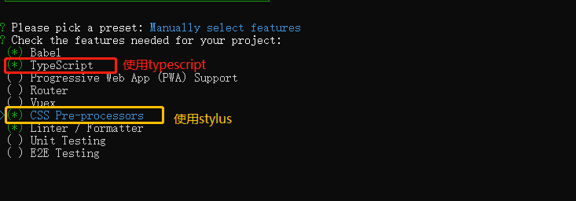
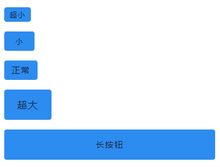
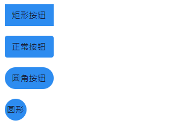
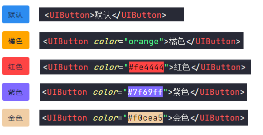
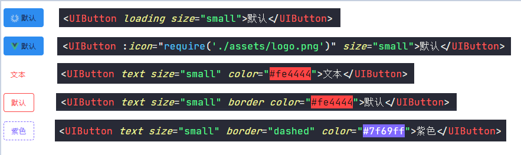

# vue+typescript实现组件封装之button篇
前言

最近工作不是很忙，于是计划封装一个内部的组件库，平时习惯了使用别人封装好的组件， 并没有深究其中原理，只觉得并不是很难，但是当自己去揭开这层面纱后， 发现里面有非常多的点值得学习， 所以记录下来分享给大家

## 明确目标
在封装Button组件之前，我们需要先分析，希望Button有哪些特性及功能。


本次项目我们采用Vue3.0 + TypeScript来实现 UIButton的封装，我们这篇文章会从零开始来介绍按钮组件的封装。

## 创建工程
我们使用Vue CLI来创建一个`vue3 + TS`的工程，首先检查一下Vue CLI的版本：
```
vue -V
@vue/cli 4.3.1
```
如果大家的版本低于4.3.1，想要升级的话， 可以在命令行中输入`npm i -g @vue/cli`进行手动升级。

首先我们创建一个 vue3的项目：
```
vue create uifan
```
具体的创建过程和创建vue2项目没有什么区别，这里就不一步步介绍了， 说一下我这个项目选择了哪些选项：



## 实现基础按钮
首先我们需要实现一个基础的按钮， 包括按钮默认的一些样式、按钮标题以及按钮点击事件处理。
在`components`文件夹下创建`button`文件夹，文件夹内创建`UIButton.vue`文件：
```javascript
// UIButton.vue
<template>
    <button
        @click="onClickBtn"
        class="ui-btn"
    >
        <slot>按钮</slot>
    </button>
</template>

<script lang="ts">
import { Component, Vue, Emit } from "vue-property-decorator";

@Component
export default class App extends Vue {
    @Emit("click") private emitClick(event: MouseEvent) {}
    // 创建私有方法
    private onClickBtn(event: MouseEvent) {
        if (!this.disabled) {
            this.emitClick(event);
        }
    }
}
</script>

<style lang="stylus" scoped>
.ui-btn
    min-width 64px
    height 36px
    padding 0 16px
    border 0 solid black
    border-radius 4px
    font-size 0.875rem
    font-weight 500
    letter-spacing 0.09em
    cursor pointer
    color #17233d
    background-color #2d8cf0
    outline none
    user-select none
</style>
```
从上面代码可以看出，`UIButton`其实是对原生的button的一个封装，上面这个按钮组件实现了：
1. 按钮的基本样式
2. 按钮标题可以在组件使用时写
3. 按钮点击事件处理

接下来可以对封装的 `UIButton`组件进行使用：
```html
 <UIButton @click="onClick" ></UIButton>
 <UIButton @click="onClick" >我的Button</UIButton>
```

## 添加尺寸控制
封装几个常用的尺寸，例如迷你型（mini）、小型(small)、普通按钮(normal)、大型按钮(large)以及长按钮（long），使用时根据需求设置尺寸，不同尺寸的大小，他们的高度、字体大小以及padding值是不同， 首先展示一下不同尺寸封装完展示效果:
 


首先我们需要处理不同尺寸的样式，给不同尺寸设置不同的class来控制样式， 所以`UIButton`组件的class需要修改成动态的：
```javascript
 <button
        @click="onClickBtn"
        :class="[
            'ui-btn',
            size ? `ui-btn--${size}` : ''
        ]"
    >
        <slot>按钮</slot>
    </button>
```
size 是通过在组件是传入的， 所以使用`@Prop`接受：
```javascript
import { Component, Vue, Emit, Prop } from "vue-property-decorator";
export default class App extends Vue {
    // 尺寸 mini small normal large
    @Prop(String) private size: string | undefined;
}
```

最后设置`ui-btn--mini`,`ui-btn--small`等样式， 由于我们使用stylus的混合来实现（类似于js的函数），不了解stylus混合的小伙伴自行学习一下。
```css
@import "../style/var.styl";
resize(minWidth, height, paddingLR, fontSize)
    min-width minWidth
    height height
    padding 0 paddingLR
    font-size fontSize
.ui-btn
    ...
    &.ui-btn--mini
        resize($button-mini-width, $button-mini-height, $button-mini-paddingLR,$button-mini-font-size)
    &.ui-btn--small
        resize($button-small-width, $button-small-height, $button-small-paddingLR,$button-small-font-size)
    &.ui-btn--large
        resize($button-large-width, $button-large-height, $button-large-paddingLR,$button-large-font-size)
    &.ui-btn--normal
        resize($button-normal-width, $button-normal-height, $button-normal-paddingLR,$button-normal-font-size)
    &.ui-btn--long
        width 100%
```
其中`$button-mini-width`和`$button-mini-height`这些变量是我在`var.styl`文件中定义好的全局变量， 文末github地址可以查看完整代码。这样我们就要定义好了不同size的button按钮， 使用如下：
```html
<UIButton size="mini">超小</UIButton>
<UIButton size="small">小</UIButton>
<UIButton size="large">超大</UIButton>
```

## 控制按钮形状
提供的形状包含矩形按钮、圆角矩形、圆角按钮以及圆形按钮，默认情况下的按钮是圆角矩形的，下图为我们要封装的组件包含的形状：



通过传递`square`、`round`、`circle`分别代表矩形、圆角和圆形按钮，首先动态绑定class来控制按钮圆角样式
```JavaScript
 <button
        @click="onClickBtn"
        :class="[
            'ui-btn',
            size ? `ui-btn--${size}` : '',
            {
                'ui-btn--square': square,
                'ui-btn--round': round,
                'ui-btn--circle': circle,
            },
        ]"
    >
        <slot>按钮</slot>
    </button>

```
`square`、`round`、`circle`是通过组件使用是传递的， 在`UIButton`中需要prop接受这个三个变量:
```javascript
//形状
@Prop(Boolean) private round: boolean | undefined; //圆角
@Prop(Boolean) private square: boolean | undefined; //方形
@Prop(Boolean) private circle: boolean | undefined; //圆形
```
在写stylus要注意一点，圆形和圆角按钮的`border-radius`值与按钮高度有关， 所以可以写在上边定义的`resize`混合中：
```css
resize(minWidth, height, paddingLR, fontSize)
    min-width minWidth
    height height
    padding 0 paddingLR
    font-size fontSize
    &.ui-btn--round, &.ui-btn--circle
        border-radius (@height / 2)
    &.ui-btn--circle
        width @height
        min-width 0
        padding 0
.ui-btn
    ...
    &.ui-btn--square
        border-radius 0
```
使用如下：
```html
<UIButton square="square">矩形按钮</UIButton>
<UIButton >正常按钮</UIButton>
<UIButton round="round">圆角按钮</UIButton>
<UIButton circle="circle">圆形</UIButton>
```
## 设置按钮颜色
颜色包括按钮的背景颜色、文本颜色的控制。



从图中可以看到，通过传入`color`就可以设置主色；传入`titleColor`控制按钮标题的颜色， 当不设置标题颜色时， 采用默认的标题颜色。
```html
<!-- template -->
 <button
        @click="onClickBtn"
        :class="[
            'ui-btn',
            size ? `ui-btn--${size}` : '',
            {
                'ui-btn--round': round,
                'ui-btn--square': square,
                'ui-btn--circle': circle,
            },
        ]"
        :style="
            `
            --color-tint: ${TintColor};
            --color-title: ${TitleColor}
        `
        "
    >
        <slot>按钮</slot>
    </button>
```
上面代码中使用了两个stylus变量`--color-tint`和`--color-title`，分别用来表示按钮主色和标题颜色，这里我们需要使用到计算属性来获取颜色值，在类组件中定义计算属性和定义方法很相似， 只是方法前边需要加一个`get`，上面有获取颜色值的是两个计算属性`TintColor`以及`TitleColor`。先看一下两个计算属性如何定义的：
```JavaScript
// script
@Prop(String) private color: string | undefined; //主色
@Prop(String) private titleColor: string | undefined; //标题颜色
// 计算属性
private get TintColor() {
    if (this.color) {
        return this.color;
    }
    return "#2d8cf0";
}

private get TitleColor() {
    if (this.titleColor) {
        return this.titleColor;
    }
    return "#17233d";
}
```
看上面的代码，有的小伙伴可能会疑惑，为什么不直接使用`color`和`titleColor`， 而是要用计算属性呢？
是因为当我们没有传入`color`或者`titleColor`时， 我们获取到的undefined， 将undefined赋值给stylus变量，会导致没有默认颜色， 所以这里才用了计算属性。 当然也可以通过给接收到的`color`写默认值， 这种方式也是可行的。

接下来看一下stylus样式中是如何来定义`--color-tint`和`--color-title`两个变量的, 在样式中添加如下两句代码即可
```css
.ui-btn
    min-width 64px
    ...
    color var(--color-title, #17233d)
    background-color var(--color-tint, #2d8cf0)
    ...
```
好啦！按钮颜色相关的设置完成了，接下来我们看一下如何给按钮设置禁用

## 设置禁用
实际开发中禁用按钮是非常常见的，一般都是设置一个`disable`属性， 那我们也这样来做。

button标签中根据`disable`值动态绑定类名`ui-btn--disabled`， 这里我暂时隐藏一些已经实现但不相关的代码：
```html
<!-- template -->
 <button
        @click="onClickBtn"
        :class="[
            'ui-btn',
            size ? `ui-btn--${size}` : '',
            {
                ...
                'ui-btn--disabled': disabled
            },
        ]"
        "
    >
        <slot>按钮</slot>
    </button>
```
`UIButton`中接收 `disable`：
```javascript
// 禁用
@Prop(Boolean) private disabled: boolean | undefined;
```
然后在添加`ui-btn--disabled`样式：
```css
ui-btn
    &.ui-btn--disabled
        background-color #efeff6
        color #bbbdc1
        cursor not-allowed
```
## 设置阴影
给按钮添加阴影，使用css3属性`box-shadow`给元素设置阴影:
```
box-shadow: X偏移量 Y偏移量 模糊半径 扩展大小 阴影颜色 投影方式
```
这里就不过多的介绍`box-shadow`每个值代表的意义， 不清楚的可以去学习一下。

我们希望可以直接给`UIButton`组件添加一个shadow属性， 并且可以给`shadow` 赋值， 比如：
```html
<UIButton shadow="2">阴影2</UIButton>
<UIButton shadow="5">阴影5</UIButton>
```
然后对应在组件中就可以通过`ui-shadow-2`、`ui-shadow-5` 这样的类来控制：
```html
<template>
    <button
        @click="onClickBtn"
        :class="[
            'ui-btn',
            ShadowValue,
            ...
        ]"
    >
        <slot>按钮</slot>
    </button>
</template>

<script lang="ts">
@Prop([String, Number]) readonly shadow: string | number | undefined;
private get ShadowValue() {
    if(this.shadow){
        return `ui-shadow--${this.shadow}`
    }
    return `ui-shadow--0`
}
</script>

<style lang="stylus">
Shadow(a, b, c)
    box-shadow 0 a rgba(0,0,0,0.2), 0 b rgba(0,0,0,0.14), 0 c rgba(0,0,0,0.12)
.ui-btn
    &.ui-shadow--1
        Shadow(2px 1px -1px, 1px 1px 0, 1px 3px 0)
    &.ui-shadow--2
        Shadow(3px 1px -2px, 2px 2px 0, 1px 5px 0)
    &.ui-shadow--3
        Shadow(3px 3px -2px, 3px 4px 0, 1px 8px 0)
    &.ui-shadow--4
        Shadow(2px 4px -1px, 4px 5px 0, 1px 10px 0)
</style>
```

## 按钮类型设置
我们封装的按钮想要提供线框按钮、文本按钮以及图标按钮可供选择, 功能效果如下：



通过设置属性
- `loading`控制加载按钮；
- `icon`设置图标按钮；
- `text`设置文本按钮；
- `border`设置边框按钮

通过设置类名`ui-btn--loading`、`ui-btn--text`以及`ui-btn--icon`;其中边框设置了`ui-btn--dashed`和`ui-btn--solid`来控制实现边框与虚线边框：

```html
<!-- template -->
 <button
        :class="[
            ...
            border === 'dashed'
                ? 'ui-btn--dashed'
                : border
                ? 'ui-btn--solid'
                : '',
            {
                ...
                'ui-btn--loading': loading,
                'ui-btn--text': text,
                'ui-btn--icon': icon,
            },
        ]"
    >
        <div v-if="loading" class="ui-loading-circle ui-icon--default ">
            
        </div>
        <div v-if="icon" class="ui-icon--default">
            
        </div>
        <span v-if="$slots.default"><slot>按钮</slot></span>
        <slot v-else>按钮</slot>
    </button>
```
组件接受参数定义：
```javascript
 // 按钮类型
    @Prop(Boolean) readonly text: boolean | undefined; //文本按钮
    @Prop([Boolean, String]) readonly border: boolean | string | undefined; // 边框按钮
    @Prop(Boolean) readonly loading: string | undefined; // 加载中按钮
    @Prop(String) readonly icon: string | undefined; // 图标按钮
```
最后设置的类的样式：
```css
&.ui-btn--loading, &.ui-btn--icon
    position relative
    vertical-align middle
    .ui-icon--default
        display inline-block
        margin-right 4px
        line-height 0
        >img
            vertical-align: middle
            width 1em
            height 1em
            display inline-block
&.ui-btn--solid
    border 1px solid var(--color-title, #17233d)
&.ui-btn--dashed
    border 1px dashed var(--color-title, #17233d)
&.ui-btn--text,&.ui-btn--solid
    background-color transparent
```

最后，还对代码进行一些优化，将这里就不一一的描述了， 可以查看完整版本的代码，github地址：https://github.com/fanquan/UIFan

# 给我留言
<Vssue title="给我留言" />


