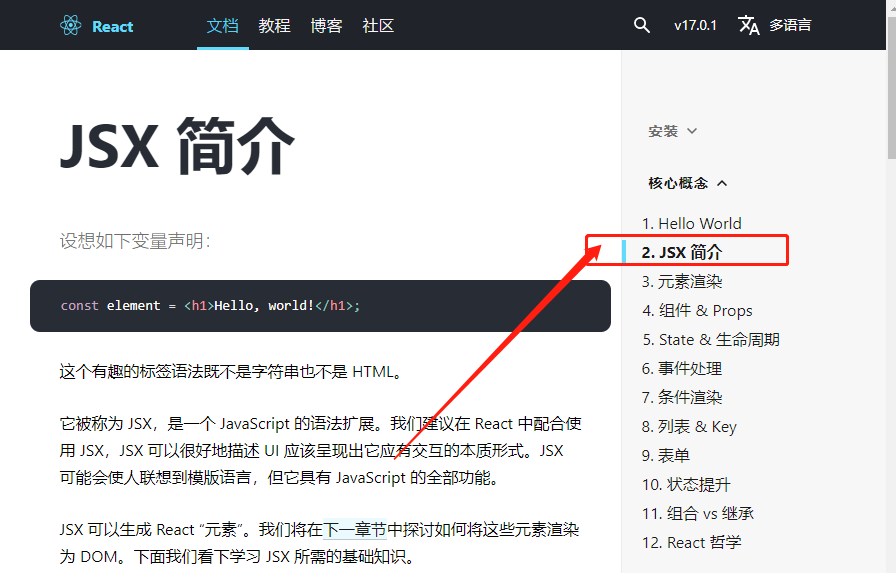
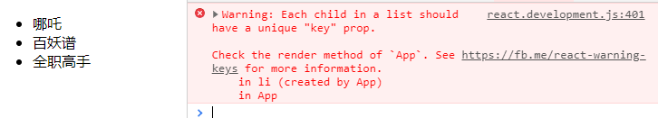

我们在学习React时， 打开官网，从开始学习遇到的第一个问题就是JSX语法，如果你使用React,相必对JSX语法相当熟悉了，可以选择跳过前面基础讲解。

## JSX是什么？

简单来理解JSX就是 JavaScript 和 html 可以混着写，开发者在开发过程中可以更加灵活快速，并且可以一目了然的看清楚DOM结构。

我们来看一下它长什么样：
```html
<script type="text/babel">
const hello = <h3>Hello JSX</h3>
<script>
```
这段代码看起来很像普通的html标签,额，，，仔细看， 将标签赋给了`hello`变量，而且标签不是一段字符串(**因为没有使用引号包裹**)，这是什么操作？？

这个其实就是JSX语法，也有很多地方将它称为 JavaScript XML, 因为看起来就是一段XML。这里还有一个注意点，虽然JSX用于描述UI界面，但是浏览器是不支持JSX的，因此我们需要借助工具`Babel`将jsx编译为JavaScript再经过渲染插入到页面上（也就是上面为什么加上`type="text/babel"`），往后看我们会学习react中JSX编译原理；先看一下编译效果，打开[babel官网](https://www.babeljs.cn/repl)， 将代码进行编译

```jsx
const hello = <h3>Hello JSX</h3>
```

得到结果：
```javascript
var hello = React.createElement("h3", null, "Hello JSX");
```
从这个结果，我们也不难理解网上很多关于 `JSX是一个语法糖`的说法，它主要用来取代`React.createElement()`产生React Element。

这里我们还要讨论一个问题， 就是为什么React相中了JSX了呢？

## React 为什么要用JSX

关于React为什么要选择JSX,官方文档上也是有说明的：
1. React 认为渲染逻辑本质上与其他UI逻辑存在内在耦合
   - 比如在UI中需要绑定处理事件
   - 当UI上展示的数据发生变化时，又需要改变UI
2. 因为上面的原因， 所以React并没有将标记与逻辑分离到不同的文件，而是将他们共同存放在`组件`中，后面我们也会深入学习组件
3. React 虽然选择了JSX，但是**并不强制要求使用**
   - 我们只要知道，JSX其实就是嵌入JavaScript中的一种语法结构
   - 大多数人发现，在 JavaScript 代码中将 JSX 和 UI 放在一起时，会在视觉上有辅助作用

接下来我们就正式学习一下JSX的使用。


## JSX的特性及使用
### 嵌入表达式
如果我们的JSX中的内容是动态的，可以使用大括号`{}`，来插入一个 JavaScript 表达式, 大括号中可以是变量、字符串、数组、函数调用等任意js表达式：
```jsx
let title ="Hello JSX"
const comics = ["哪吒", "百妖谱", "全职高手"]
const isString = true
ReactDOM.render(
    <div>
        {/* 嵌入变量 */}
        <h2>{title}</h2>
         {/* 嵌入字符串 */}
        <p>{"我是字符串内容"}</p>
          {/* 表达式 */}
        <p>{isString? title : comics }</span>
    </div>
)
```
### JSX 属性绑定
实际开发中， HTML 标签的很多属性都是动态获取的， 比如`img`标签的`src`属性，又如 `a`标签的`href`属性，标签动态绑定`class`、`style`等等

先我们演示一下属性绑定：
```javascript
const imgUrl ="https://tinyurl.com/y3pdvhb4"
const hrefUrl ="https://www.baidu.com"
ReactDOM.render(
    <div>
       
       <a href={hrefUrl}>点击跳转</a>
    </div>
)
```
JSX 给标签绑定属性时，只需要`{}`中写对应的 JavaScript 代码即可， 接下来重点说一下动态绑定 `class`和`style`

#### 动态绑定 class
在React中元素 `class` 属性与类`class`关键字重复， 所以JSX中不允许直接写 `class` ,而是使用 `className`代替。

1. 情况1：`className`是动态拼接的
2. 情况2：多个`className`值，其中部分是动态绑定的， 部分是固定的
```javascript
const iconName="delete"
const isSelected= true
ReactDOM.render(
    <div>
      {/* 情况1 */}
       <span className={'icon-' + iconName}></span>

       {/* 情况2 ,两种方式*/}
       <ul>
          <li className={"item " + (isSelected ? "selected": "")}></li>
          <li className={["item", (isSelected ? "selected": "")].join(" ")}></li>
       </ul>
    </div>
)
```

#### JSX中绑定样式`style`
在JSX中使用样式和真实的样式也很类似，通过`style`属性来定义，但和真实DOM不同的是，`属性值不能是字符串而必须为对象`。

```jsx
<div style={{color:"red", fontSize:"14px", backgroundColor:"#fff"}}></div>

{/* 或者 */}
var style ={
  color:"red", 
  fontSize:"14px", 
  backgroundColor:"#fff"
}
<div style={style}></div>
```

要明确记住,`{}`里面是JS代码,这里传进去的是标准的JS对象。在JSX中可以使用所有的样式，基本上属性名的转换规范就是将其写成驼峰写法，例如 `background-color` 变为 `backgroundColor` , `font-size`变为`fontSize`，这和标准的 JavaScript 操作 DOM 样式的 API 是一致的。

### JSX 条件渲染
实际开发中，我们经常会遇到界面的内容根据数据不同状态而展示不同内容，或者根据条件决定是否渲染某些内容。使用过vue的小伙伴可能会想到使用`v-if`这样的指令来实现， 但是React 并没有这样的指令，而是更加的灵活，所以需要我们手动的实现。

当逻辑较多时，可以通过条件判断，如下：
```jsx
function render(){
  const isLogin = true
  let avatar = "https://tinyurl.com/y3pdvhb4"
  let content = null
  if(isLogin){
    content = <div><span>退出登录</span></div>
  }else{
    content = <div>请登录</div>
  }
  ReactDOM.render(
    <div>
      {content}
    </div>
  )}
render()
```

当然我们也可以使用三元运算符的方式来实现条件渲染：
```jsx
  const isLogin = true
  let avatar = "https://tinyurl.com/y3pdvhb4"

  ReactDOM.render(
    <div>
      isLogin? <div><span>退出登录</span></div>
      : <div>请登录</div>
    </div>
  )}
```
三元运算符可以用来没有太多逻辑判断的代码，只是根据不同条件直接返回结果。

从上面的代码其实可以很好的感受到，使用JSX实现`v-if`指令这种效果是非常简单的，所以才说React 非常灵活~

### JSX 列表渲染
开发中常见的另一个场景就是将大量数据遍历展示到页面上，同样React没有像Vue`v-for`那样的指令。我们可以通过JavaScript代码的方式组织数据， 转成JSX; 列表渲染一般我们使用`map`方法来实现。
```jsx
const comics = ["哪吒", "百妖谱", "全职高手"]

ReactDOM.render(
    <ul>
      comics.map(item =>{
        return (
          <li>{item}</li>
        )
      })
    </ul>
  )
```
列表渲染的方式，是通过`map`方法来实现的， 返回值是一个数组，每一项都是jsx。



上面代码的运行结果会有一个警告，告诉我们需要在列表展示的jsx中添加一个`key`，但是这个警告并不是报错，代码可以继续运行;至于为什么要添加这个`key`以及添加和不添加有什么区别， 后面学习React中会讲到。

还有一点就是代码里`map`中的`return`我们可以省略，但是就不能使用`{}`，优化后代码如下：
```jsx
const comics = ["哪吒", "百妖谱", "全职高手"]

ReactDOM.render(
    <ul>
      comics.map((item, index) => (
          <li key={index}>{item}</li>
        ))
    </ul>
  )
```

## JSX的优点
通过对JSX的学习，我们可以总结出以下几个优点：
1. 可以用声明的方式去创建界面， 这是非常直观的过程，或有非常多的HTML标记， 除了原生的还可以自己定义， 可以非常方便的描述 UI。
2. 拥有代码灵活性，你想什么时候创建、隐藏节点，或者改变节点属性，都像写JavaScript代码一样， 非常的灵活
3. 我们不用再去学一门新的模板语言，只要熟悉 JavaScript 语法和 JSX 特性，就可以用 JSX 来写组件
   

## 使用JSX 注意点
### 1.必须有一个顶级标签
```jsx
// 错误
ReactDOM.render(
  <h2>动漫列表</h2>
  <ul>
    <li>天官赐福</li>
  </ul>
)

// 正确
ReactDOM.render(
  <div>
    <h2>动漫列表</h2>
    <ul>
      <li>天官赐福</li>
    </ul>
  </div>
)
```
这样每次都必须用一个根标签来包裹， 有时候这个标签并没任何意义时，我们并不想页面多出来这么一个父元素，此时可以使用`Fragment`,它是React 16版本新增的, 可以将它看着是占位符，能够使外层包裹的元素隐藏。
```jsx
ReactDOM.render(
  <Fragment>
    <h2>动漫列表</h2>
    <ul>
      <li>天官赐福</li>
    </ul>
  </Fragment>
)
```

### 2.`()`包裹JSX语法
为了方便阅读，我们通常在jsx外层包裹一个小括号，如果没有jsx进行书写时不能换行：
```jsx
// 错误
let element = <div>
  <h1>标题</h1>
<div>

{/* 正确 */}
let element = (<div>
  <h1>标题</h1>
<div>)
```
### 3.关闭标签
单标签必须以`/>`结尾
```jsx
// 错误


{/* 正确 */}

```


## React 中JSX编译的原理
上面我们提到了JSX其实是`React.createElement` 函数的语法糖，所以的JSX最终都会被转成`React.createElement`的函数调用。
下边来具体看看jsx处理逻辑，上栗子:
```jsx
const hello ="Hello JSX";
<h2 title="title" ref="title">{hello}, meet you!</h2>
```
babel编译为：
```javascript
var hello = "Hello JSX";

React.createElement("h2", {
  title: "title",
  ref: "title"
}, hello, ", meet you!");
```
关键部分是`React.createElement`,看官网的定义：
```javascript
React.createElement(
  type,
  [props],
  [...children]
)
```

`createElement`接受三个参数：

1. type： 当前ReactElement的类型
  - 若是标签元素， 那么就使用对应标签字符串表示(如上边的`h2`标签)
  - 若是组件，则直接使用组件名称
  - 如果是`Fragment`, 也直接使用`Fragment`

2. props


## React 17.0.0-rc.2带来全新的JSX转换
React 17.0.0-rc.2 不久前发布，并带来了有关 JSX 新的特性,并且还将对全新JSX转换的支持移植到React v16.14.0，React v15.7.0和0.14.10版本上。 此外，之前的JSX转换也将继续支持和维护。我们这里可以认识一下这个新特性。

- 用`jsx()`函数替换 `React.createElement()`
- 自动引入`jsx()`函数

举个例子:
```jsx
const hello = () => <h3>Hello JSX</h3>
```
会被转译成

```jsx
import {jsx as _jsx} from 'react/jsx-runtime'; // 由编译器自动引入

const Hello = () => _jsx('h3', { children: 'Hello JSX' }); // 不是 React.createElement
```
React 官方提供了如何使用新的转译语法的说明和自动迁移的工具，[详见文档](https://zh-hans.reactjs.org/blog/2020/09/22/introducing-the-new-jsx-transform.html)


