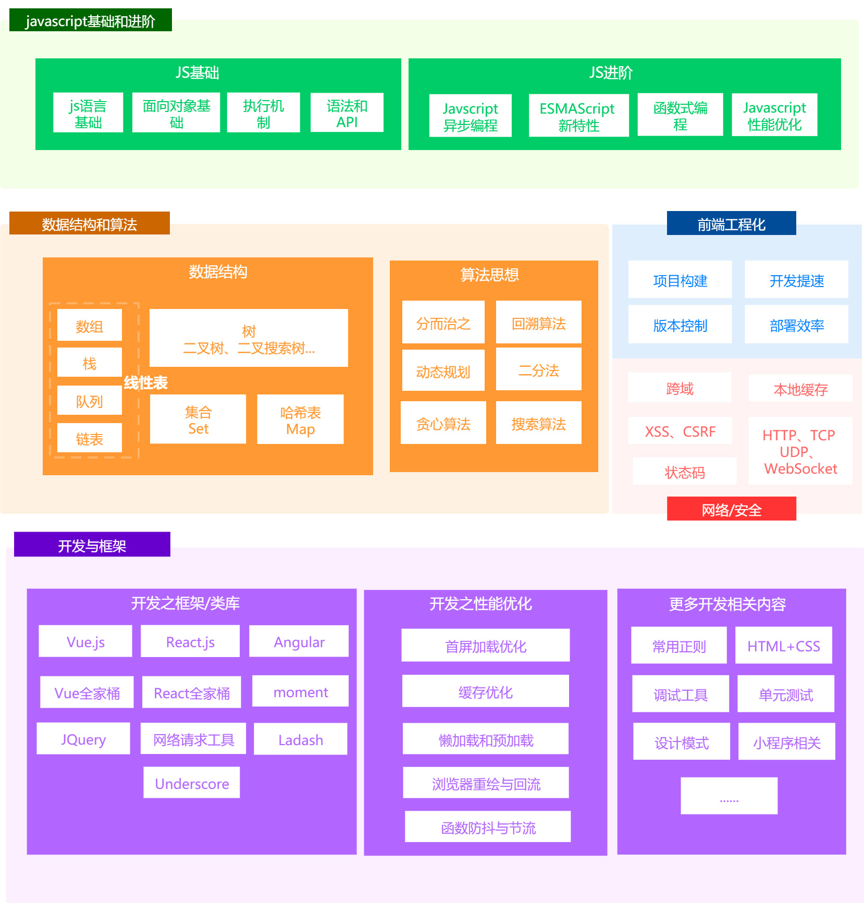

# 大厂面试题与大前端知识体系结合

::: tip TIP
你好，我是饭饭，你是否曾对前端学习充满迷茫，是否每天在碎片化的学习中焦虑，那么你可以选择和我一起学习，将碎片化的知识构建成 <font color=red>知识体系</font> ，提升自身技术
#### 不积跬步，无以至千里，脚踏实地的走稳每一步
:::

## 前端知识体系总览


## 适合什么样的人阅读
- 前端入门者：
- 进阶中的前端
- 计划换工作的：

**加入我们**

- 搜索公众号 **`前端饭圈`** 或者 **`下方二维码`** 进行关注
<!-- - [Github 链接在此, 欢迎点个 Start](https://github.com/koala-coding/goodBlog) -->
- 将好文章分享给您身边更多的小伙伴
<!-- - 如果你想更好的约束自己坚持每日学习, 欢迎加入 [day day up](https://github.com/koala-coding/day-day-up) 项目 -->


<!-- 小熊猫 -->
<!--  -->

<!--

## 关于

### 📚Blog1

这是一个兼具博客文章、知识管理、文档查找的个人网站，主要内容是 Web 前端技术。如果你喜欢这个博客&主题欢迎到[GitHub](https://github.com/xugaoyi/vuepress-theme-vdoing)点个 Star、获取源码，或者交换[友链](/friends/) ( •̀ ω •́ )✧

### 🎨Theme

本站主题是根据[VuePress](https://vuepress.vuejs.org/zh/)的默认主题修改而成。取名`Vdoing`(维度)，旨在轻松打造一个`结构化`与`碎片化`并存的个人在线知识库&博客，让你的知识海洋像一本本书一样清晰易读。配合多维索引，让每一个知识点都可以快速定位！ 更多[详情](https://github.com/xugaoyi/vuepress-theme-vdoing)。

<a href="https://github.com/xugaoyi/vuepress-theme-vdoing" target="_blank"></a>
<a href="https://github.com/xugaoyi/vuepress-theme-vdoing" target="_blank"></a>

</br>

## 特色功能

博客部分特色功能介绍

#### 一站式技术搜索

博客内容中包含部分技术教程，可以利用搜索框快速搜索到相关文档，即使博客中没有的，你还可以选择最下方的 `在XXX中搜索“xxx”` 快速到达你想要找的内容。

#### 深色模式与阅读模式

关爱程序员，保护视力，点击右下角的主题模式按钮试试吧~

#### Demo 演示模块

为了更直观的展示一些代码的效果，博客添加了 demo 模块插件，可查看 demo、源码，以及跳转到 codepen 在线编辑。**示例**：

::: demo [vanilla]

```html
<html>
  <div id="vanilla-box"></div>
</html>
<script>
  var box = document.getElementById('vanilla-box')
  box.innerHTML = 'Hello World! Welcome to EB'
</script>
<style>
  #vanilla-box {
    color: #11a8cd;
  }
</style>
```

:::

## :email: 联系

- **WeChat or QQ**: <a href="tencent://message/?uin=894072666&Site=&Menu=yesUrl" class='qq'>894072666</a>
- **Email**: <a href="mailto:894072666@qq.com">894072666@qq.com</a>
- **GitHub**: <https://github.com/xugaoyi>

</br>
-->
